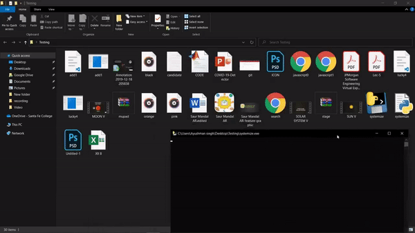

# Systemize


Project name is a `Systemize` that `Helps` you to `organize your PC by automatically organizes all of your files into the grouping of a similar kind together` such as images, PDFs, presentations, videos, and others, getting rid of clutter. So it’s easy to keep it tidy and find exactly what  you’re looking for.

<a></a>

``With Systemize, a cluttered desktop/folders are a Thing of the Past.``
When you run Systemize, it expands to show the grouped files.


## Prerequisites

Before you begin, ensure you have met the following requirements:

* ✅Be sure You have installed the latest version of `Python 3.x+` and `pip` (optional) by running these on your command prompt:
---
> - `python --version`
> - `pip -V`
---

* ✅You have a `Windows/Linux/Mac` machine.
* ✅And `the desktop/folder that get very cluttered`.

## Installing Systemize

To install Systemize, follow these steps:

Linux and macOS:
```
pip install systemize
```

Windows:
```
pip install systemize
```
## Using Systemize

To use `Systemize`, follow these steps:

---
> **Note:**
> - ✅Be sure to be inside the folder you want to organize the disorder🧽and running python on your command prompt
---
```
import systemize
systemize.here() 
```


## Contributing to Systemize

To contribute to Systemize, follow these steps:

1. Fork this [repository](https://github.com/ayushman17/Systemize).
2. Create a branch: `git checkout -b <branch_name>`.
3. Make your changes and commit them: `git commit -m '<commit_message>'`
4. Push to the original branch: `git push origin <project_name>/<location>`
5. Create the pull request.

Alternatively see the GitHub documentation on [creating a pull request](https://help.github.com/en/github/collaborating-with-issues-and-pull-requests/creating-a-pull-request).


## Contact

If you want to contact me you can reach me at <ascb508@gmail.com>.

## License
<!--- If you're not sure which open license to use see https://choosealicense.com/--->

This project uses the following license: [MIT License](https://github.com/ayushman17/Systemize/blob/master/LICENSE.txt).
